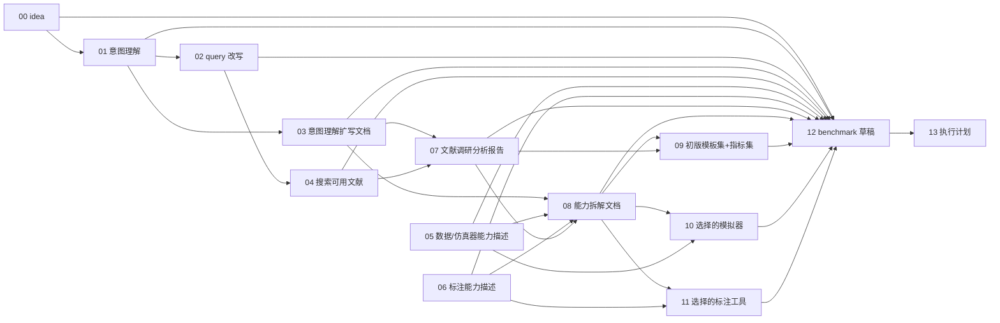

# BenchClaw Stage1 DAG Skill

## 目的

本 skill 将用户的粗糙 benchmark idea 转化为 Stage1 的设计草稿和执行计划。它严格采用 **DAG/ready-set 并行调度**，不是 0→1→2→... 的串行流水线；但末端必须是 12→13，因为执行计划必须基于 benchmark 草稿。

## 关键约束

1. 不允许把编号理解为执行顺序。编号只表示手绘图中的节点编号。
2. 每个子流程都有自己的 `skills/<id>-*/SKILL.md`。
3. 调度器必须按 `dag.json` 的 `parents` 判断可运行节点；同一 `parallel_layer` 内的节点应由不同 subagent 并行执行。
4. `05 数据/仿真器能力描述` 与 `06 标注能力描述` 是外部能力文档整理节点，不依赖 `03 意图理解扩写文档`，也不能把 `03` 的意图扩写当成能力来源。
5. `12 benchmark 草稿` 是 Stage1 的设计汇总节点；`13 执行计划` 只能在 `12` 完成后运行，并且 `13` 的唯一父节点是 `12`。
6. 所有最终结论必须能回溯到 `idea / query / 文献 / 数据能力 / 标注能力 / 能力拆解 / 模板指标` 中的来源，不允许凭空补齐。

## DAG




## Ready-set 并行层

| 层 | 可并行运行的节点 | 说明 |
|---|---|---|
| L0 | 00, 05, 06 | 接收并冻结 idea；并行整理外部数据/仿真器能力文档与外部标注工具能力文档 |
| L1 | 01 | 意图理解 |
| L2 | 02, 03 | query 改写与意图扩写可并行分发 |
| L3 | 04 | 文献召回依赖 02；`05/06` 不依赖 03，已在 L0 读取外部文档 |
| L4 | 07 | 文献分析依赖 03 与 04 |
| L5 | 08 | 能力拆解依赖 03/05/06/07 |
| L6 | 09, 10, 11 | 模板指标、模拟器选择、标注工具选择并行 |
| L7 | 12 | benchmark 草稿汇总 |
| L8 | 13 | 只读取 12 的执行计划生成 |

## 输入目录

默认工作区：`WORKSPACE_ROOT/stage1/`

`BENCHCLAW_ROOT` 必须解析为当前 skill 所在的 BenchClaw 根目录，也就是包含本 `skills/` 目录的父级项目根。

建议输入：

- `input/user_idea.md`：用户粗糙 benchmark idea。
- `input/simulatorCards/`：可选，仿真器能力卡。
- `input/annotation_tool_cards/`：可选，标注工具能力卡。
- `input/prior_benchmarks/`：可选，已有 benchmark 文档或摘要。
- `input/constraints.md`：可选，预算、时间、模型、仿真器、不能使用人工等约束。

`05 数据/仿真器能力描述` 的优先外部输入：

- `BENCHCLAW_ROOT/simulatorCards`：仿真器能力描述 skill/card。
- `BENCHCLAW_ROOT/benchmarkDatasetCards`：已有 benchmark 数据集描述 skill/card。
- `BENCHCLAW_ROOT/realDatasetCards`：真实数据源描述 skill/card。

`06 标注能力描述` 的优先外部输入：

- `BENCHCLAW_ROOT/annotation-tool`：标注工具能力、I/O、部署和限制说明 skill 文档。

## 输出目录

每个节点只写自己的目录，不覆盖其他节点输出：

- `stage1/00_idea/`
- `stage1/01_intent/`
- `stage1/02_query/`
- `stage1/03_intent_doc/`
- `stage1/04_literature_search/`
- `stage1/05_data_capability/`
- `stage1/06_annotation_capability/`
- `stage1/07_literature_analysis/`
- `stage1/08_capability_decomposition/`
- `stage1/09_templates_metrics/`
- `stage1/10_simulator_selection/`
- `stage1/11_annotation_tool_selection/`
- `stage1/12_benchmark_draft/`
- `stage1/13_execution_plan/`

## 执行协议

1. 读取 `dag.json`。
2. 找到所有 `parents` 已完成的节点。
3. 将同一 ready-set 中的节点分配给不同 subagent。
4. 每个 subagent 只读取其声明的父节点输出与输入目录。
5. 每个 subagent 在写业务产物前读取 `contracts/intermediate_files.md` 中对应节点的中间文件契约；子 skill 中的摘要只作导航，字段和边界以该契约为准。
6. 每个 subagent 必须遵守 `contracts/quality_gates.md` 的通用质量门，并执行子 skill 中的节点专属质量门。
7. 每个节点完成后写入自己的 `DONE.json`，格式如下：

```json
{
  "node_id": "08",
  "status": "done",
  "inputs_read": ["stage1/03_intent_doc/expanded_intent.md"],
  "outputs_written": ["stage1/08_capability_decomposition/capability_dimensions.md"],
  "blocked_by": [],
  "quality_gates": {"traceability": "pass"}
}
```

## 串行化防错规则

运行前必须执行：

```bash
python scripts/validate_dag.py dag.json
```

该脚本会检查：

- 是否存在环。
- 是否存在 0→1→2→... 的伪串行链。
- 是否存在至少三个含多节点的并行层。
- `13` 是否只依赖 `12`，且 `12` 是否在 `13` 的上一层。

## 最终交付物

Stage1 结束时必须至少产生：

1. `stage1/12_benchmark_draft/benchmark_draft.md`
2. `stage1/12_benchmark_draft/design_traceability_table.csv`
3. `stage1/13_execution_plan/execution_plan.md`
4. `stage1/13_execution_plan/stage2_handoff.yaml`
5. `stage1/_stage1_report.md`，汇总 DAG 执行状态、并行层、失败节点和回溯关系。
